# FIAP Hack - Sistema de Processamento de Vídeos

Sistema completo de processamento de vídeos com arquitetura distribuída, autenticação, filas de processamento e interface web moderna, implementado na AWS com alta disponibilidade e escalabilidade.

## 🏗️ Arquitetura da Infraestrutura

```mermaid
graph TB
    subgraph "Internet"
        INTERNET[Internet]
    end

    subgraph "AWS Cloud"
        subgraph "VPC - 10.0.0.0/16"
            subgraph "Availability Zone A (us-east-1a)"
                subgraph "Public Subnet A - 10.0.1.0/24"
                    IGW[Internet Gateway]
                    NAT_A[NAT Gateway A]
                    ALB[Application Load Balancer]
                end
                
                subgraph "Private Subnet A - 10.0.10.0/24"
                    EKS_NODE_A1[EKS Node Group A1]
                    EKS_NODE_A2[EKS Node Group A2]
                    RABBITMQ_EC2[RabbitMQ EC2 Instance]
                end
            end
            
            subgraph "Availability Zone B (us-east-1b)"
                subgraph "Public Subnet B - 10.0.2.0/24"
                    NAT_B[NAT Gateway B]
                end
                
                subgraph "Private Subnet B - 10.0.11.0/24"
                    EKS_NODE_B1[EKS Node Group B1]
                    EKS_NODE_B2[EKS Node Group B2]
                    RDS_AZ_B[RDS PostgreSQL Multi-AZ]
                end
            end
            
            subgraph "Availability Zone C (us-east-1c)"
                subgraph "Private Subnet C - 10.0.12.0/24"
                    RDS_AZ_C[RDS PostgreSQL Multi-AZ]
                end
            end
        end
        
        subgraph "EKS Cluster - fiap-hack-cluster"
            subgraph "Namespace: video-processor"
                VIDEO_SERVICE[Video Processing Service]
                VIDEO_SERVICE_REPLICA[Video Service Replica]
                VIDEO_SERVICE_HPA[Horizontal Pod Autoscaler]
            end
            
            subgraph "Namespace: auth"
                AUTH_SERVICE[Auth Service - Lambda]
            end
            
            subgraph "Namespace: redis"
                REDIS_MASTER[Redis Master]
                REDIS_PVC[Redis Persistent Volume]
            end
            
            subgraph "Namespace: monitoring"
                PROMETHEUS[Prometheus Server]
                PROMETHEUS_PVC[Prometheus Storage]
                GRAFANA[Grafana Dashboard]
                GRAFANA_PVC[Grafana Storage]
            end
        end
        
        subgraph "AWS Managed Services"
            COGNITO[AWS Cognito User Pool]
            SECRETS[AWS Secrets Manager]
            ECR[Amazon ECR Registry]
            S3[Amazon S3 Bucket]
            CLOUDWATCH[CloudWatch Logs & Metrics]
        end
        
        subgraph "External Services"
            GMAIL[Gmail SMTP]
            FFMPEG[FFmpeg Processing]
        end
    end

    %% Internet connections
    INTERNET --> IGW
    INTERNET --> ALB
    
    %% VPC routing
    IGW --> NAT_A
    IGW --> NAT_B
    NAT_A --> EKS_NODE_A1
    NAT_A --> EKS_NODE_A2
    NAT_A --> RABBITMQ_EC2
    NAT_B --> EKS_NODE_B1
    NAT_B --> EKS_NODE_B2
    
    %% Load balancer
    ALB --> VIDEO_SERVICE
    ALB --> VIDEO_SERVICE_REPLICA
    
    %% EKS cluster
    EKS_NODE_A1 --> VIDEO_SERVICE
    EKS_NODE_A2 --> VIDEO_SERVICE_REPLICA
    EKS_NODE_B1 --> REDIS_MASTER
    EKS_NODE_B2 --> PROMETHEUS
    EKS_NODE_A1 --> GRAFANA
    
    %% Service connections
    VIDEO_SERVICE --> RABBITMQ_EC2
    VIDEO_SERVICE --> RDS_AZ_B
    VIDEO_SERVICE --> REDIS_MASTER
    VIDEO_SERVICE --> S3
    VIDEO_SERVICE --> SECRETS
    VIDEO_SERVICE --> GMAIL
    VIDEO_SERVICE --> FFMPEG
    
    AUTH_SERVICE --> COGNITO
    AUTH_SERVICE --> SECRETS
    
    %% Monitoring
    PROMETHEUS --> VIDEO_SERVICE
    PROMETHEUS --> REDIS_MASTER
    GRAFANA --> PROMETHEUS
    CLOUDWATCH --> VIDEO_SERVICE
    CLOUDWATCH --> AUTH_SERVICE
    
    %% Storage
    REDIS_MASTER --> REDIS_PVC
    PROMETHEUS --> PROMETHEUS_PVC
    GRAFANA --> GRAFANA_PVC
    
    %% Container registry
    ECR --> VIDEO_SERVICE
    ECR --> VIDEO_SERVICE_REPLICA
    
    %% Database
    RDS_AZ_B -.->|Multi-AZ| RDS_AZ_C
    
    %% Styling
    classDef internet fill:#e3f2fd
    classDef vpc fill:#f3e5f5
    classDef eks fill:#e8f5e8
    classDef aws fill:#fff3e0
    classDef external fill:#ffebee
    classDef storage fill:#f1f8e9
    
    class INTERNET internet
    class IGW,NAT_A,NAT_B,ALB,EKS_NODE_A1,EKS_NODE_A2,EKS_NODE_B1,EKS_NODE_B2,RABBITMQ_EC2,RDS_AZ_B,RDS_AZ_C vpc
    class VIDEO_SERVICE,VIDEO_SERVICE_REPLICA,VIDEO_SERVICE_HPA,AUTH_SERVICE,REDIS_MASTER,PROMETHEUS,GRAFANA eks
    class COGNITO,SECRETS,ECR,S3,CLOUDWATCH aws
    class GMAIL,FFMPEG external
    class REDIS_PVC,PROMETHEUS_PVC,GRAFANA_PVC storage
```



## 🚀 Alta Disponibilidade e Escalabilidade

### **Alta Disponibilidade**

**Multi-Zona Deployment:**
- **VPC** distribuída em 3 Availability Zones (us-east-1a, us-east-1b, us-east-1c)
- **EKS Cluster** com nodes distribuídos em múltiplas AZs
- **RDS PostgreSQL** configurado em Multi-AZ com failover automático
- **RabbitMQ** em instância EC2 com backup automático
- **Redis** com Persistent Volume Claims para persistência de dados

**Load Balancing:**
- **Application Load Balancer** distribuindo tráfego entre pods
- **Kubernetes Services** com ClusterIP para comunicação interna
- **Auto-scaling** baseado em métricas de CPU e memória

**Fault Tolerance:**
- **Health Checks** em todos os serviços
- **Liveness e Readiness Probes** no Kubernetes
- **Circuit Breakers** implementados nos serviços
- **Retry Policies** para comunicação entre serviços

### **Escalabilidade Horizontal e Vertical**

**Auto-Scaling:**
- **Horizontal Pod Autoscaler (HPA)** para o serviço de vídeo
- **EKS Node Groups** com auto-scaling baseado em demanda
- **RDS** com capacidade de scaling vertical
- **S3** com escalabilidade ilimitada

**Performance:**
- **CDN** para assets estáticos
- **Redis** para cache distribuído
- **Connection Pooling** para banco de dados
- **Async Processing** com RabbitMQ

## 🛠️ Tecnologias Utilizadas

### **Infraestrutura como Código**
- **Terraform** - Provisionamento e gerenciamento de infraestrutura
- **AWS Provider** - Integração com serviços AWS
- **Kubernetes Provider** - Gerenciamento de recursos K8s
- **Helm** - Gerenciamento de charts Kubernetes

### **Cloud Computing**
- **Amazon Web Services (AWS)** - Plataforma cloud principal
- **Amazon EKS** - Kubernetes gerenciado
- **Amazon RDS** - Banco de dados PostgreSQL gerenciado
- **Amazon S3** - Armazenamento de objetos
- **Amazon ECR** - Registry de containers
- **Amazon Cognito** - Autenticação e autorização
- **AWS Secrets Manager** - Gerenciamento de segredos
- **AWS CloudWatch** - Monitoramento e logs

### **Containerização e Orquestração**
- **Docker** - Containerização de aplicações
- **Kubernetes** - Orquestração de containers
- **Kubernetes Deployments** - Gerenciamento de aplicações
- **Kubernetes Services** - Networking interno
- **Kubernetes Persistent Volumes** - Armazenamento persistente
- **Horizontal Pod Autoscaler** - Auto-scaling automático

### **Redes e Segurança**
- **Amazon VPC** - Rede virtual privada
- **Security Groups** - Firewall de instâncias
- **NAT Gateways** - Acesso à internet para recursos privados
- **Internet Gateway** - Conectividade com internet
- **Route Tables** - Roteamento de tráfego
- **IAM Roles** - Controle de acesso baseado em identidade

### **Banco de Dados e Cache**
- **PostgreSQL** - Banco de dados relacional principal
- **Redis** - Cache em memória e sessões
- **RabbitMQ** - Sistema de mensageria e filas
- **Connection Pooling** - Otimização de conexões

### **Monitoramento e Observabilidade**
- **Prometheus** - Coleta e armazenamento de métricas
- **Grafana** - Visualização e dashboards
- **CloudWatch Logs** - Centralização de logs
- **CloudWatch Metrics** - Métricas de infraestrutura
- **Health Checks** - Verificação de saúde dos serviços

### **CI/CD e DevOps**
- **GitHub Actions** - Pipeline de integração e deploy contínuo
- **Docker Compose** - Orquestração local
- **Make** - Automação de tarefas
- **Terraform Backend S3** - Estado remoto do Terraform

### **Desenvolvimento e Runtime**
- **Node.js** - Runtime JavaScript/TypeScript
- **NestJS** - Framework backend
- **React** - Framework frontend
- **TypeScript** - Linguagem de programação tipada
- **FFmpeg** - Processamento de vídeo
- **AMQP** - Protocolo de mensageria

### **Segurança**
- **JWT** - Tokens de autenticação
- **OAuth 2.0** - Protocolo de autorização
- **HTTPS/TLS** - Criptografia em trânsito
- **Encryption at Rest** - Criptografia em repouso
- **IAM Policies** - Políticas de acesso granular

## 📊 Métricas de Infraestrutura

- **3 Availability Zones** para alta disponibilidade
- **6 Subnets** (3 públicas, 3 privadas)
- **2 NAT Gateways** para redundância
- **Multi-AZ RDS** com failover automático
- **Auto-scaling** baseado em demanda
- **99.9%+ SLA** para serviços críticos

## 🔄 Fluxo de Processamento

1. **Upload** via frontend React
2. **Autenticação** via AWS Cognito
3. **Validação** e armazenamento no S3
4. **Enfileiramento** no RabbitMQ
5. **Processamento** com FFmpeg
6. **Notificação** via email
7. **Armazenamento** do resultado no S3
8. **Métricas** enviadas para Prometheus

## 📁 Estrutura do Projeto

```
fiap-hack/
├── app/                    # Frontend React/TypeScript
├── auth/                   # Serviço de autenticação (NestJS)
├── service/                # Serviço de processamento (NestJS + K8s)
├── vpc/                    # Rede AWS (Terraform)
├── eks/                    # Cluster Kubernetes (Terraform)
├── database/               # PostgreSQL RDS (Terraform)
├── redis/                  # Cache Redis (Terraform + K8s)
├── rabbitmq/               # Sistema de filas (Terraform + EC2)
├── monitoring/             # Prometheus + Grafana (Terraform + K8s)
└── README.md
```

## 🚀 Deploy

O deploy segue a ordem de dependências:

1. **VPC** → **EKS** → **Database** → **RabbitMQ** → **Redis** → **Monitoring** → **Services**

```bash
# Deploy completo
make deploy-all

# Deploy individual
cd vpc && make deploy
cd eks && make deploy
cd database && make deploy
cd rabbitmq && make deploy
cd redis && make deploy
cd monitoring && make deploy
cd service && make deploy
```

## 📈 Monitoramento

- **Grafana**: http://grafana.monitoring.svc.cluster.local:3000
- **Prometheus**: http://prometheus.monitoring.svc.cluster.local:9090
- **CloudWatch**: Console AWS
- **Health Checks**: `/health` endpoints

---
